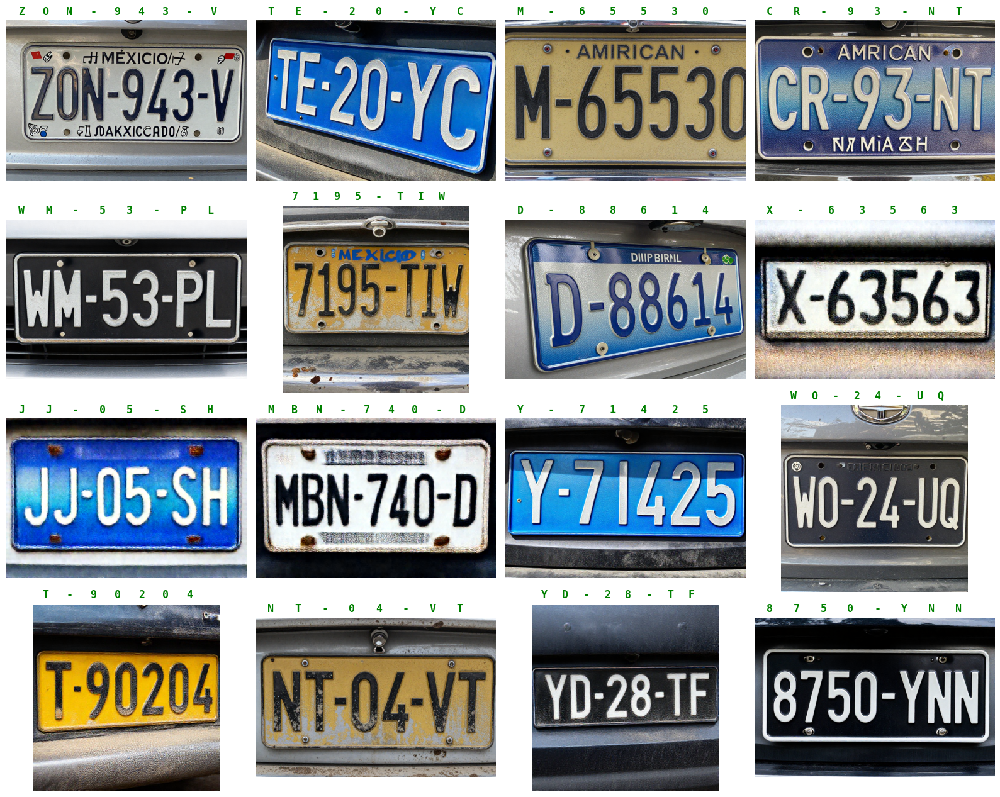

# 🏷️ Local VLM License Plate Extractor

A lightweight, fully local Python pipeline that leverages Small Vision-Language Models (SLMs) to perform zero-shot Optical Character Recognition (OCR) on license plate images. 

This script is specifically designed to rapidly process raw, scraped images and automatically label them by extracting the plate text and injecting it directly into the filename. It serves as an excellent preprocessing step for building structured datasets.


---

## 🧠 Architecture & Methodology

Instead of training a dedicated OCR model from scratch, this tool uses a prompt-engineered local Vision-Language Model to "read" the images.

* **Model:** `qwen3.5-0.8b` (A highly efficient, sub-1-billion parameter vision model).
* **Local Server:** LM Studio or Ollama (via OpenAI-compatible API).
* **Technique:** Zero-Shot extraction using strict system prompting.
* **Optimization:** `temperature=0` and strict `stop` tokens (`["\n", " "]`) are enforced to prevent model hallucinations and ensure deterministic, concise outputs.

---

## ⚡ Key Features

* **100% Local & Private:** No cloud APIs are used. Processing runs entirely on your local machine, avoiding API costs and privacy concerns.
* **Strict Formatting:** The system prompt forces the model to return *only* the alphanumeric characters—stripping spaces, dashes, and conversational filler.
* **Automated Dataset Labeling:** Processes an entire folder of raw images and copies them to an output directory, prepending the detected license plate to the original filename (e.g., `12319.jpg` $\rightarrow$ `ABC1234_12319.jpg`).
* **Error Handling:** Gracefully handles API timeouts or unreadable images by returning a safe fallback (`NOT_FOUND` or `ERROR`) without crashing the batch process.

---

## 📂 Project Structure & Data Flow

* **`Placas_Input/`:** Drop your raw, unorganized, or web-scraped license plate images here (`.jpg`, `.jpeg`, `.png`).
* **`Dataset/RenameWebScrap/`:** The output directory where the script will save the successfully labeled copies.

### The Prompting Strategy
To ensure the tiny `0.8B` model performs like a strict OCR engine, the script uses the following bounded instructions:
> *"You are a specialized OCR tool for vehicle license plates. Your ONLY task is to extract the license plate number from the image. Rules: 1. Return ONLY the alphanumeric characters of the plate. 2. No spaces, no dashes, no extra text. 3. If no plate is found, return 'NOT_FOUND'. 4. Do not explain anything."*

---

## 🛠️ Quick Start Guide

### 1. Prerequisites
* Python 3.x
* `requests` library (`pip install requests`)
* A local AI server running (LM Studio or Ollama).

### 2. Configure Local Server
Start your local API server. By default, the script expects the server to be listening on port `1234`.
* **If using LM Studio:** Load the `qwen3.5-0.8b` vision model and start the local server via the GUI.
* **If using Ollama:** Ensure the `OLLAMA_HOST` or proxy is routing the OpenAI-compatible endpoint correctly, or adjust the `API_URL` in the script to `http://localhost:11434/api/chat`.

### 3. Run the Extractor
You can use the script in two ways:

**Option A: Single Image Test**
Uncomment the bottom line in the script to test a single file:
```python
extract_plate("Dataset/WebScrap/12319.jpg")
```

**Option B: Batch Process a Folder**
Uncomment the `process_plates` function call to iterate through your entire input directory:
```python
process_plates(INPUT_FOLDER)
```

Run the script:
```bash
python ocr_renamer.py
```

---

## 📈 Use Cases

This tool is highly effective as the "first pass" in a larger Machine Learning pipeline:
1. **Dataset Bootstrapping:** Quickly label thousands of web-scraped images to train more complex, dedicated models (like YOLO or TrOCR).
2. **Data Cleaning:** Identify images where no plate is visible (flagged as `NOT_FOUND`) to easily filter out junk data from your dataset.